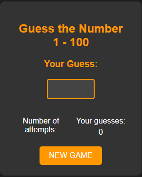

# Guess-the-NumberJS

"Guess the NumberJS" is a game created using JS in which you have to guess the number that the computer chose and thus win the game. 
The player has up to 10 attempts.

## Calculator

